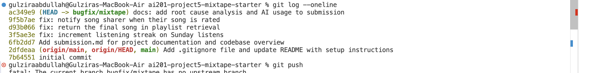

# Mixtape — Bug Hunt Submission

## AI Usage

I used **Claude Code** (Anthropic's CLI, running the Opus model) throughout this project. Being specific about how:

**What I asked it to explain / trace / summarize.** I had it read the whole repo and produce the "Codebase Map" below — the model of routes → services → models, the association tables, and the two end-to-end data-flow traces (add-to-playlist and listen → streak). For each bug I had it follow the call chain from the HTTP action down to the service function rather than jumping straight to the service file, and to tell me which files it read and what pointed it to the root-cause line. That navigation is written into each RCA entry.

**What it helped me understand.** The `playlist_entries.position` design (ordering is an explicit stored column, not insertion order) and *why* that matters for issue #5. The notification "pull model" — that `create_notification()` just writes a row and the recipient discovers it on their next fetch — which made the missing call in `rate_song()` (issue #4) obvious once I compared it against the working `add_to_playlist()`. And SQLAlchemy's ORM identity-map behavior, which turned out to be the crux of #3.

**Where I had to verify things myself / where the AI was wrong.** This is the important one. The AI's *initial static reading* of the code (the "Things worth a second look" section it wrote from just reading the source) confidently listed the search bug (#3) as real: it claimed the `outerjoin` on `song_tags` "produces one result row per tag → duplicates in search." I insisted on the reproduce-first rule and ran `pytest tests/test_search.py` — **all search tests passed.** The AI's explanation was wrong for this code path: because `search_songs()` selects whole `Song` entities, SQLAlchemy's ORM deduplicates them by primary key and the join fanout never surfaces as duplicate results. Only running the tests caught that; the code-reading alone pointed me in the wrong direction. So I dropped #3 and fixed #4 instead. I also verified the boundary conditions myself rather than trusting the fix — checking Sun→Mon (not just Sat→Sun) for the streak, and the single-song playlist for #5 (where the old `[:-1]` silently returned zero songs). I chose which three bugs to fix and the commit structure.

**Honest bottom line:** the AI did the heavy lifting on reading and tracing the code and drafting these notes; my role was directing it, enforcing reproduce-before-fix, and independently verifying the reproductions and boundaries — which is exactly where its confident-but-wrong #3 claim would otherwise have slipped through.

---

# Mixtape — Codebase Map

Mixtape is a Flask + SQLAlchemy REST API for a social music app: users share songs, rate them, build collaborative playlists, track listening streaks, and see what friends are listening to. There is no frontend — every feature is a JSON endpoint. The app is organized in three layers: **routes** (HTTP), **services** (business logic), and **models** (persistence).

---

## Main files and what each does

### Top level

- **`app.py`** — Application factory. `create_app(config=None)` builds the Flask app, wires up the single shared `db = SQLAlchemy()` instance, and registers the four blueprints under URL prefixes: `/songs`, `/playlists`, `/users`, `/feed`. Defaults to a SQLite DB at `instance/mixtape.db` (overridable via `DATABASE_URL`). Calls `db.create_all()` inside an app context on startup.
- **`models.py`** — All persistence. Defines 6 models plus 3 association tables (detailed below). IDs are string UUIDs generated by `generate_uuid()`; timestamps default to timezone-aware UTC.
- **`seed_data.py`** — Standalone script (`python seed_data.py`) that drops and recreates all tables, then inserts 5 users with friendships, 25 songs (with 0, 1, and 3+ tags), 3 playlists, ~2 weeks of listening events, existing streaks, and existing notifications. Used to get a realistic DB for manual testing.
- **`requirements.txt`** — Flask, Flask-SQLAlchemy, pytest.

### `models.py` — the data model

Six models:

- **`User`** — `username`, `email`, `listening_streak` (int), `last_listened_at`, `created_at`. Has a self-referential many-to-many `friends` relationship (via the `friendships` join table) declared `lazy="dynamic"`. `to_dict()` exposes id, username, streak, and last-listened time.
- **`Tag`** — just `id` + unique `name`.
- **`Song`** — `title`, `artist`, `album`, `genre`, `shared_by` (FK → User, the original sharer), `shared_at`, `share_note`. Related to `Tag` many-to-many via `song_tags`. `to_dict()` includes a flattened `tags` list of tag-name strings.
- **`ListeningEvent`** — one row per listen: `user_id`, `song_id`, `listened_at`. This is the raw event log that both streaks and the feed are computed from.
- **`Rating`** — `user_id`, `song_id`, `score` (1–5), `rated_at`. A `UniqueConstraint(user_id, song_id)` enforces one rating per user per song — there is no separate "review" model, the score lives directly on this row.
- **`Playlist`** — `name`, `created_by`, `is_collaborative` (bool, default True). Related to `Song` many-to-many via `playlist_entries`.
- **`Notification`** — `user_id` (recipient), `notification_type` (e.g. `"song_added_to_playlist"`, `"song_rated"`), `body` (human-readable text), `read` (bool), `created_at`.

Three association tables:

- **`friendships`** — symmetric user↔user, two FK columns to `user.id`.
- **`song_tags`** — plain song↔tag join.
- **`playlist_entries`** — the interesting one: it's a song↔playlist join **plus extra columns** — `position` (int, NOT NULL), `added_by` (FK → User), and `added_at`. So a playlist has an *explicit ordering* (`position`), not just insertion order, and it records who added each song. This ordering column is what `playlist_service` sorts on.

### `routes/` — HTTP layer (blueprints)

Each file is a Flask blueprint. Routes parse the request, call one service function, and format the JSON response. They own status codes and catch `ValueError` (which services raise for "not found" / bad input).

- **`routes/songs.py`** (`/songs`) — `GET /search?q=`, `GET /<song_id>`, `POST /<song_id>/rate`, `POST /<song_id>/listen`. Delegates to `search_service` (search/get), `notification_service.rate_song`, and `streak_service.record_listening_event`.
- **`routes/playlists.py`** (`/playlists`) — `POST /` (create), `GET /<id>`, `GET /<id>/songs`, `POST /<id>/songs` (add song). Delegates to `playlist_service` for reads/create and to `notification_service.add_to_playlist` for adds.
- **`routes/users.py`** (`/users`) — `GET /<user_id>`, `GET /<user_id>/streak`, `GET /<user_id>/notifications?unread_only=`, `POST /notifications/<id>/read`. The plain user lookup hits the model directly; the rest delegate to `streak_service` and `notification_service`.
- **`routes/feed.py`** (`/feed`) — `GET /<user_id>/listening-now`, `GET /<user_id>/activity`. Delegates to `feed_service`.

### `services/` — business logic (where the real work — and the bugs — live)

- **`streak_service.py`** — `record_listening_event()` writes a `ListeningEvent` and calls `update_listening_streak()`, which applies the streak rules (first listen → 1; same day → no change; consecutive day → +1; gap → reset to 1) based on `user.last_listened_at`. `get_streak()` reads the stored int.
- **`feed_service.py`** — `get_friends_listening_now()` returns each friend's most recent listen within a 24h `RECENT_THRESHOLD`, deduped to one row per friend, newest first. `get_activity_feed(limit=20)` returns the most recent N friend listens with no recency filter.
- **`search_service.py`** — `search_songs(query)` does a case-insensitive `ILIKE` match on title OR artist, `outerjoin`ed to `song_tags`. `get_song(id)` fetches one song or raises `ValueError`.
- **`notification_service.py`** — the notification hub. `create_notification()` is the low-level writer. `add_to_playlist()` appends a song to a playlist and notifies the song's original sharer. `rate_song()` upserts a `Rating` (one per user/song). `get_notifications()` / `mark_as_read()` read and update notifications.
- **`playlist_service.py`** — `create_playlist()`, `get_playlist_songs()` (joins `playlist_entries`, orders by `position`), `get_playlist()` (metadata only), `get_user_playlists()`.

### `tests/`

`test_streaks.py`, `test_search.py`, `test_playlists.py` — pytest suites that exercise the services (the three areas with known bugs). Run with `pytest tests/`.

---

## Data flow — tracing two real features

### Feature A: a user adds a friend's song to a playlist → sharer gets notified

This is the clearest example of the routes → services → models → notification chain:

1. **HTTP in.** `POST /playlists/<playlist_id>/songs` with JSON `{song_id, added_by}` lands in `add_song()` in [routes/playlists.py](routes/playlists.py#L43). The route validates that both fields are present (400 if not) and calls `add_to_playlist(playlist_id, song_id, added_by)`.
2. **Service logic.** `add_to_playlist()` in [services/notification_service.py](services/notification_service.py#L35) loads the `Song`, the adding `User`, and the `Playlist` (raising `ValueError` → 404/400 if any is missing). If the song isn't already in the playlist, it appends it (`playlist.songs.append(song)`) and commits.
3. **The notification side effect.** It then checks `if song.shared_by != added_by_user_id:` — i.e. don't notify yourself. If someone *else* added your song, it calls `create_notification()` with type `"song_added_to_playlist"` and a body like *"darius added your song 'X' to the playlist 'Y'."*
4. **Persistence.** `create_notification()` writes a `Notification` row addressed to `song.shared_by` (the original sharer) and commits.
5. **The recipient reads it later.** The sharer polls `GET /users/<user_id>/notifications` → `get_notifications()`, which returns their notifications newest-first. `POST /users/notifications/<id>/read` flips `read = True`.

So notifications are a **pull model**: there's no push — an interaction writes a `Notification` row, and the recipient discovers it on their next notifications fetch.

### Feature B: a user listens to a song → streak updates

1. `POST /songs/<song_id>/listen` with `{user_id}` → `listen()` in [routes/songs.py](routes/songs.py#L43) → `record_listening_event(user_id, song_id)`.
2. In [services/streak_service.py](services/streak_service.py#L14), the service creates a `ListeningEvent(listened_at=now)`, then calls `update_listening_streak(user, now)` which compares `now.date()` to `user.last_listened_at.date()` and adjusts `user.listening_streak`, then commits.
3. That same `ListeningEvent` row is later what `feed_service` reads to build "Friends Listening Now" — one write, two features consume it.

---

## Patterns I noticed

- **Strict layering, thin routes.** Every route does the same three things: parse/validate input, call exactly one service function, format the response. All business logic lives in `services/`. Routes never touch `db.session` for logic — the one exception is `GET /users/<user_id>` in [routes/users.py](routes/users.py#L12), which does a trivial `db.session.get(User, ...)` inline rather than going through a service.

- **`ValueError` as the cross-layer error protocol.** Services raise `ValueError("... not found")` for missing entities and bad input; routes catch `ValueError` and translate it to a 404 (for reads) or 400 (for writes). There are no custom exception classes — the string message becomes the JSON `error` field.

- **Single shared `db`, no circular-import pain.** `db` is defined in `app.py` and imported everywhere. `models.py` imports from `app`, and services import from both `app` and `models`. Where a service needs a model that would create an import cycle, it imports **inside the function** — e.g. `add_to_playlist()` does `from models import Playlist` and `from services.playlist_service import get_playlist_songs` locally.

- **UUID string PKs + `to_dict()` serialization everywhere.** Every model generates a UUID string id and owns a `to_dict()` that the services call to produce JSON-safe dicts. Timestamps are serialized with `.isoformat()`. Services return lists of dicts, never raw model objects, so routes can `jsonify()` directly.

- **The event log is the source of truth.** `ListeningEvent` rows are written once and read by multiple features (streaks, listening-now feed, activity feed). `Rating` and `Notification` follow the same "append a row, derive views later" style.

- **Ordering is explicit, not implicit.** `playlist_entries.position` means playlist order is a stored value the service sorts on — a deliberate choice over relying on insertion/row order.

- **Notifications are typed and generic.** A single `Notification` model with a `notification_type` string field handles all notification kinds, rather than a table per type. New notification types just need a new type string + a `create_notification()` call.

### Things worth a second look (this is a bug-hunt repo)

Reading the services against their own docstrings, a few spots don't match their stated contract — consistent with the five open issues in the README:

- **`playlist_service.get_playlist_songs()`** returns `songs[:-1]` — it slices off the **last** song. The docstring says "returns all songs in the playlist," so the last song in a playlist would never show up (README issue #5).
- **`streak_service.update_listening_streak()`** has an extra `and today.weekday() != 6` condition on the consecutive-day increment — so a Sunday listen never increments the streak and instead falls through to the reset branch (README issue #1).
- **`search_service.search_songs()`** `outerjoin`s `song_tags` but doesn't de-duplicate, so a song with multiple tags produces one result row per tag → duplicates in search (README issue #3).
- **`feed_service`** uses a 24h `RECENT_THRESHOLD` for "listening now," which is a full day rather than a "right now" window — likely why yesterday's listeners still appear (README issue #2).
- **`notification_service.rate_song()`** never calls `create_notification()`, so rating a song notifies nobody, even though adding to a playlist does (README issue #4).

These are noted here as part of understanding the code; fixes belong in their own commits on `bugfix/mixtape`.

---

## Bug Fixes — Root Cause Analysis

I chose **three** issues to fix: #1 (streak), #5 (playlist last song), and #4 (rating notifications). I also *attempted* #3 (search duplicates) but could not reproduce it — see the note at the end.

### Issue #1 — "My listening streak keeps resetting" (`streak_service.py`)

- **Symptom (what the user experienced):** A user who listened to music every day still saw their streak drop back to 1 instead of climbing. The reset wasn't random — it happened specifically every Sunday, so any streak that would have carried through a Sunday was wiped.
- **How I reproduced it:** Ran `pytest tests/test_streaks.py`. `test_streak_increments_on_sunday` fails — it records a listen on Saturday 2024-06-15 (streak → 1) then Sunday 2024-06-16, and asserts the streak becomes 2. Instead it resets to 1 (`assert 1 == 2`). The trigger condition is precise: the *second* consecutive listen must fall on a Sunday.
- **Navigation (symptom → cause):** Started from the action "user listens" → route `POST /songs/<song_id>/listen` in [routes/songs.py](routes/songs.py) → it calls `record_listening_event()` in [services/streak_service.py](services/streak_service.py). That function writes the `ListeningEvent` then delegates the streak math to `update_listening_streak()` in the same file — the branch comparing `days_since_last` is where the reset happens, so that was the root-cause site.
- **Root cause:** In `update_listening_streak()`, the consecutive-day branch was guarded by an extra clause: `elif days_since_last == 1 and today.weekday() != 6:`. `weekday() == 6` is Sunday, so a listen on Sunday — even one day after the previous listen — skipped the increment branch and fell through to `else: user.listening_streak = 1`, resetting the streak every Sunday.
- **Fix:** Removed the `and today.weekday() != 6` condition ([services/streak_service.py:73](services/streak_service.py#L73)), so any listen exactly one calendar day after the last one increments the streak regardless of weekday. One-line change; no other logic touched.
- **Boundary verification (both sides of the Sunday boundary):** Sat→Sun → 2 ✓; Sun→Mon → 2 ✓ (the other adjacent day); Sun→Tue (2-day gap) → resets to 1 ✓; two listens the same Sunday → stays 1 ✓; Sat→Sun→Mon → 3 ✓ (streak survives across Sunday). The `days_since_last == 0` (same day) and `>= 2` (gap) branches are untouched and still behave correctly.

### Issue #5 — "The last song in a playlist never shows up" (`playlist_service.py`)

- **Symptom (what the user experienced):** When a user opened a playlist, the final song they'd added was always missing from the list. A 5-song playlist displayed 4 songs; a 3-song playlist displayed 2. The song was still in the database — it just never came back from the "get playlist songs" endpoint.
- **How I reproduced it:** Ran `pytest tests/test_playlists.py`. `test_playlist_returns_all_songs` seeds a playlist of 5 songs (positions 1–5) and gets back only 4; `test_playlist_returns_songs_in_order` shows the returned list ends at "Track 4" and drops "Track 5". Any non-empty playlist reproduces it — the last-by-position entry is always missing.
- **Navigation (symptom → cause):** Started from "view a playlist's songs" → route `GET /playlists/<id>/songs` in [routes/playlists.py](routes/playlists.py) → it calls `get_playlist_songs()` in [services/playlist_service.py](services/playlist_service.py). Read that function top-to-bottom: the query itself correctly `join`s `playlist_entries` and orders by `position` (ascending), so ordering was fine — the defect was on the very last line, the list comprehension's slice.
- **Root cause:** `get_playlist_songs()` returned `[song.to_dict() for song in songs[:-1]]`. The `[:-1]` slice drops the final element after the results were already correctly ordered by `position`, so the highest-position (last) song is always omitted. The docstring explicitly says "returns all songs in the playlist," so the slice contradicts the contract.
- **Fix:** Changed `songs[:-1]` to `songs` ([services/playlist_service.py:66](services/playlist_service.py#L66)) so all songs are returned. One-token change.
- **Boundary verification (list-size edges):** empty playlist → `[]` ✓ (important: `[][:-1]` was also `[]`, so the empty case never surfaced the bug — the empty-playlist test still passes after the fix); **single-song** playlist → 1 song ✓ (this is the telling edge — the old `[:-1]` returned 0 here, silently hiding a one-song playlist entirely); five-song playlist → 5 songs in position order ✓. Ordering is preserved because the fix only removed the trailing slice, not the `order_by`.

### Issue #4 — "I got notified when a friend added my song to a playlist but not when they rated it" (`notification_service.py`)

- **Symptom (what the user experienced):** When someone added your shared song to a playlist you received a notification, but when someone *rated* your shared song you received nothing at all — an inconsistency between two very similar interactions with your song.
- **How I reproduced it:** No test covers this, so I wrote a small repro script: create a sharer (alice) and a rater (bob), have alice share a song, then call `rate_song(bob, song, 5)` and read `get_notifications(alice)`. Result was `[]` — no notification was created. Contrast with `add_to_playlist()`, which does create one under the same "someone interacted with your shared song" condition.
- **Navigation (symptom → cause):** The issue title itself names the asymmetry — playlist-add notifies, rating doesn't. Started from "user rates a song" → route `POST /songs/<song_id>/rate` in [routes/songs.py](routes/songs.py) → `rate_song()` in [services/notification_service.py](services/notification_service.py). Read it side-by-side with `add_to_playlist()` in the same file (the working case): `add_to_playlist()` ends with a `create_notification()` call guarded by `if song.shared_by != added_by_user_id:`, whereas `rate_song()` had no such call at all — the missing side effect was obvious from the comparison.
- **Root cause:** `rate_song()` upserts the `Rating` row and commits, but never calls `create_notification()` — the notification side effect was simply missing, unlike its sibling `add_to_playlist()`.
- **Fix:** After the commit, added a `create_notification()` call ([services/notification_service.py:108](services/notification_service.py#L108)) mirroring `add_to_playlist()`: it notifies `song.shared_by` with type `"song_rated"` and a body like *"bob rated your song 'X' 5/5."*, guarded by `if song.shared_by != user_id:` so rating your own song doesn't notify yourself.
- **Related-functionality check:** The change is purely additive (a new notification after an unchanged commit), so the rating upsert path is untouched — re-rating still updates the existing `Rating` in place (`UniqueConstraint(user_id, song_id)` respected). Confirmed via script that (a) a cross-user rating now yields exactly one `song_rated` notification with the correct body, and (b) a self-rating adds none. `add_to_playlist()`'s existing notification behavior was not modified, and the full suite (`pytest tests/`, 13 tests) still passes.

### Issue #3 — attempted, could not reproduce (`search_service.py`)

- **How I tried to reproduce it:** Ran `pytest tests/test_search.py`, including `test_search_no_duplicates_multi_tag_song`, which searches for a song carrying three tags and asserts it appears exactly once. **All search tests pass** — the duplicate never materializes.
- **Why:** Although `search_songs()` `outerjoin`s `song_tags` (which fans out one join row per tag and *looks* like it should duplicate), the query selects whole `Song` entities via `db.session.query(Song)`. SQLAlchemy's ORM deduplicates returned entities by primary-key identity, collapsing the join fanout back to one object per song. So the duplication that a raw-row query would show is silently absorbed by the ORM identity map, and the reported behavior does not occur through this code path. Per the debugging discipline (reproduce first), I set #3 aside and fixed #4 instead. A defensive `.distinct()` would still be reasonable, but I did not commit a "fix" for a bug I could not observe.

---

## Commit History

Each fix is its own commit on `bugfix/mixtape`, using conventional `fix:` messages (one commit per bug):

